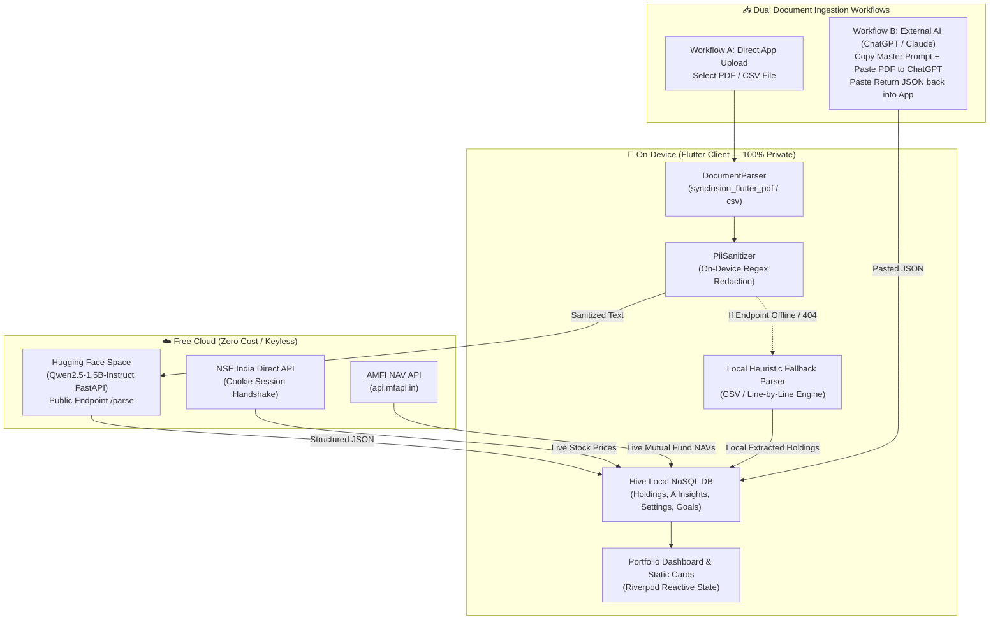

# Implementation Plan: AI-Powered Smart Finance Tracker (v3 Final)
## Indian Market · Static Insights · Zero API Keys · Dual AI Ingestion

## 🎯 Goal & Core Philosophy
Transform the Micro-Savings Goal Tracker into a **smart, AI-powered Indian wealth tracker** that can:
1. **Ingest** consolidated account summaries (bank statements, mutual fund CAS, demat holdings) via **Direct PDF/CSV Upload** OR via **External AI Prompt Copy/Paste** (ChatGPT, Claude, Gemini).
2. **Parse** documents using on-device PII sanitization and a self-hosted free LLM (or external AI prompt) to extract structured investment data.
3. **Track** Indian market holdings (equities, mutual funds, FDs, gold bonds, PPF) alongside micro-savings goals.
4. **Refresh** live prices from NSE/BSE and AMFI directly — no API key needed.
5. **Generate** static AI insight cards highlighting risk, diversification gaps, FD vs inflation, and goal pace.

**Zero user configuration required.** No API keys to paste, no paid subscriptions required.

---

## 🗺️ Final Architecture Overview



---

## 📋 Master External AI Extraction Prompt

Built into the app's upload screen via the **📋 Copy Prompt** button:

```text
You are a financial document parsing engine for Indian investment & bank statements. 
Analyze the attached document (PDF / text / CSV) and extract ALL holdings and investment data.

Output VALID JSON ONLY with zero markdown formatting or chat text, strictly matching this schema:

{
  "holdings": [
    {
      "name": "Scheme or Stock Name (e.g. HDFC Flexi Cap Fund)",
      "assetType": "equity | mutualFund | fixedDeposit | gold | ppf | bond | other",
      "quantity": 100.0,
      "avgBuyPrice": 150.0,
      "currentPrice": 175.0,
      "symbol": "NSE Ticker if stock (e.g. TCS) or null",
      "isin": "ISIN code or null",
      "folioNumber": "Folio number if mutual fund or null",
      "amcName": "AMC Name or null"
    }
  ]
}

Rules:
1. Only extract data explicitly present in the document.
2. Set assetType accurately based on asset type.
3. Numeric values must be positive numbers.
4. Output JSON ONLY. Do not include markdown codeblocks, notes, or explanations.
```

---

## 📋 Implementation Phases Summary

| Phase | Description | Key Components | Status |
|:---|:---|:---|:---|
| **Phase 1** | Data Models & Hive Adapters | `Holding` (ID 5,6), `AiInsight` (ID 7,8), `HiveBoxes` | ✅ Completed |
| **Phase 2** | Free HF Space Backend | `backend/app.py` (FastAPI + Qwen2.5-1.5B), Dockerfile | ✅ Completed |
| **Phase 3** | On-Device Privacy & Document Ingestion | `PiiSanitizer` (Regex), `DocumentParser` (PDF/CSV) | ✅ Completed |
| **Phase 4** | Keyless Indian Market Feeds | `NseMarketService` (NSE cookie session, AMFI NAV API) | ✅ Completed |
| **Phase 5** | Hybrid Insight Card Engine | `InsightGenerator` (Offline Rule Engine + AI Engine) | ✅ Completed |
| **Phase 6** | Portfolio Repository & Providers | `PortfolioRepository`, `holdingsProvider`, `aiInsightsProvider` | ✅ Completed |
| **Phase 7** | UI Views & External AI Integration | `PortfolioScreen`, `DocumentUploadScreen`, `SettingsScreen`, Master Prompt copy & JSON paste modal | ✅ Completed |

---

## 🧪 Final Verification & Quality Metrics

- **Static Code Analysis**: `flutter analyze` $\to$ **`No issues found!`** (0 warnings, 0 errors)
- **Unit Test Coverage**: `flutter test` $\to$ **`All 12 unit tests passed!`**
- **Git Repository State**: Clean working tree on branch **`feature/ai`**.
- **Infrastructure Cost**: **`$0.00 Total`**.
